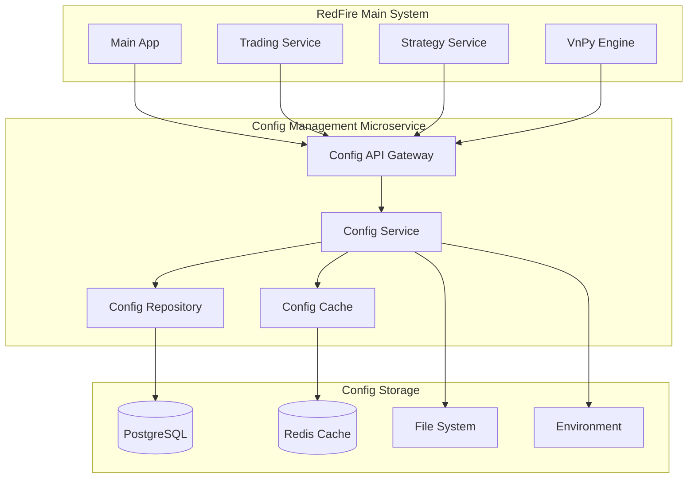

# 🚀 RedFire外部微服务配置管理器设计方案

## 📋 设计概述

**设计目标**: 舍弃复杂的DDD架构，建立简单、高效的外部微服务配置管理器  
**核心理念**: 配置即服务 (Configuration as a Service)  
**架构模式**: 简单分层 + 微服务  
**实施策略**: 渐进式替换，零停机迁移

---

## 🎯 设计原则

### **Simple First (简单优先)**
- ❌ 舍弃过度设计的DDD架构
- ❌ 移除复杂的CQRS模式  
- ❌ 简化领域服务层次
- ✅ 采用直接的三层架构: API → Service → Repository

### **Configuration as Service (配置即服务)**
- ✅ 配置管理独立微服务
- ✅ 统一的配置API接口
- ✅ 集中式配置存储
- ✅ 实时配置推送

### **Zero Downtime Migration (零停机迁移)**
- ✅ 并行运行新旧系统
- ✅ 灰度配置切换
- ✅ 实时配置同步
- ✅ 快速回滚机制

---

## 🏗️ 新架构设计

### **整体架构图**



### **微服务配置管理器核心架构**

```
┌─────────────────────────────────────────────────────────────┐
│                   Config Management Service                 │
├─────────────────────────────────────────────────────────────┤
│  📡 API Layer                                              │
│  ├── /api/config/{service}/{key}          # 获取配置      │
│  ├── /api/config/{service}                # 获取服务配置  │
│  ├── /api/config/watch/{service}          # 监听配置变更  │
│  ├── /api/config/validate                 # 验证配置      │
│  └── /api/config/reload                   # 重载配置      │
├─────────────────────────────────────────────────────────────┤
│  🔧 Service Layer                                          │
│  ├── ConfigService                        # 配置管理服务  │
│  ├── ValidationService                    # 配置验证服务  │
│  ├── NotificationService                  # 配置推送服务  │
│  └── CacheService                         # 配置缓存服务  │
├─────────────────────────────────────────────────────────────┤
│  💾 Repository Layer                                       │
│  ├── DatabaseConfigRepository             # 数据库配置    │
│  ├── FileConfigRepository                 # 文件配置      │
│  ├── EnvironmentConfigRepository          # 环境变量     │
│  └── CacheConfigRepository                # 缓存配置      │
├─────────────────────────────────────────────────────────────┤
│  📊 Storage Layer                                          │
│  ├── PostgreSQL (主配置存储)                              │
│  ├── Redis (配置缓存)                                     │
│  ├── File System (配置文件)                               │
│  └── Environment Variables (环境变量)                     │
└─────────────────────────────────────────────────────────────┘
```

---

## 📱 配置管理器核心实现

### **1. 配置数据模型**

```python
# config_service/models.py
from pydantic import BaseModel, Field
from typing import Dict, Any, Optional, List
from datetime import datetime
from enum import Enum

class ConfigType(str, Enum):
    """配置类型"""
    DATABASE = "database"
    REDIS = "redis"
    VNPY = "vnpy"
    API = "api"
    SECURITY = "security"
    MONITORING = "monitoring"

class ConfigScope(str, Enum):
    """配置作用域"""
    GLOBAL = "global"
    SERVICE = "service"
    USER = "user"
    ENVIRONMENT = "environment"

class ConfigEntry(BaseModel):
    """配置条目"""
    id: str = Field(..., description="配置ID")
    service_name: str = Field(..., description="服务名称")
    config_key: str = Field(..., description="配置键")
    config_value: Any = Field(..., description="配置值")
    config_type: ConfigType = Field(..., description="配置类型")
    scope: ConfigScope = Field(ConfigScope.SERVICE, description="配置作用域")
    environment: str = Field("production", description="环境")
    version: int = Field(1, description="配置版本")
    description: Optional[str] = Field(None, description="配置描述")
    is_encrypted: bool = Field(False, description="是否加密")
    is_active: bool = Field(True, description="是否激活")
    created_at: datetime = Field(default_factory=datetime.now)
    updated_at: Optional[datetime] = None
    created_by: str = Field("system", description="创建者")
    
    class Config:
        json_encoders = {
            datetime: lambda v: v.isoformat()
        }

class ServiceConfig(BaseModel):
    """服务配置"""
    service_name: str = Field(..., description="服务名称")
    environment: str = Field("production", description="环境")
    configs: Dict[str, Any] = Field(default_factory=dict, description="配置字典")
    version: int = Field(1, description="配置版本")
    last_updated: datetime = Field(default_factory=datetime.now)

class ConfigChangeEvent(BaseModel):
    """配置变更事件"""
    event_id: str = Field(..., description="事件ID")
    service_name: str = Field(..., description="服务名称")
    config_key: str = Field(..., description="配置键")
    old_value: Any = Field(None, description="旧值")
    new_value: Any = Field(..., description="新值")
    change_type: str = Field(..., description="变更类型: create/update/delete")
    environment: str = Field(..., description="环境")
    timestamp: datetime = Field(default_factory=datetime.now)
    changed_by: str = Field("system", description="变更者")
```

### **2. 配置服务核心实现**

```python
# config_service/services/config_service.py
from typing import Dict, Any, Optional, List
import asyncio
import json
import logging
from datetime import datetime

from .models import ConfigEntry, ServiceConfig, ConfigChangeEvent
from .repositories import ConfigRepository
from .cache import ConfigCache
from .validators import ConfigValidator
from .notifier import ConfigNotifier

logger = logging.getLogger(__name__)

class ConfigService:
    """配置管理服务"""
    
    def __init__(
        self,
        repository: ConfigRepository,
        cache: ConfigCache,
        validator: ConfigValidator,
        notifier: ConfigNotifier
    ):
        self.repository = repository
        self.cache = cache
        self.validator = validator
        self.notifier = notifier
        
    async def get_service_config(
        self, 
        service_name: str, 
        environment: str = "production"
    ) -> Optional[ServiceConfig]:
        """获取服务配置"""
        cache_key = f"service_config:{service_name}:{environment}"
        
        # 1. 尝试从缓存获取
        cached_config = await self.cache.get(cache_key)
        if cached_config:
            return ServiceConfig.parse_obj(cached_config)
        
        # 2. 从数据库获取
        config_entries = await self.repository.get_service_configs(
            service_name, environment
        )
        
        if not config_entries:
            return None
        
        # 3. 构建服务配置
        configs = {}
        for entry in config_entries:
            if entry.is_active:
                configs[entry.config_key] = entry.config_value
        
        service_config = ServiceConfig(
            service_name=service_name,
            environment=environment,
            configs=configs,
            version=max(entry.version for entry in config_entries),
            last_updated=max(entry.updated_at or entry.created_at for entry in config_entries)
        )
        
        # 4. 缓存配置
        await self.cache.set(cache_key, service_config.dict(), ttl=300)
        
        return service_config
    
    async def get_config_value(
        self,
        service_name: str,
        config_key: str,
        environment: str = "production",
        default: Any = None
    ) -> Any:
        """获取配置值"""
        service_config = await self.get_service_config(service_name, environment)
        if not service_config:
            return default
        
        return service_config.configs.get(config_key, default)
    
    async def set_config(
        self,
        service_name: str,
        config_key: str,
        config_value: Any,
        config_type: str = "api",
        environment: str = "production",
        changed_by: str = "system"
    ) -> ConfigEntry:
        """设置配置"""
        
        # 1. 验证配置
        await self.validator.validate_config(
            service_name, config_key, config_value, config_type
        )
        
        # 2. 获取现有配置
        existing_config = await self.repository.get_config(
            service_name, config_key, environment
        )
        
        # 3. 创建或更新配置
        if existing_config:
            # 更新配置
            old_value = existing_config.config_value
            existing_config.config_value = config_value
            existing_config.version += 1
            existing_config.updated_at = datetime.now()
            
            config_entry = await self.repository.update_config(existing_config)
            change_type = "update"
        else:
            # 创建新配置
            config_entry = ConfigEntry(
                id=f"{service_name}:{config_key}:{environment}",
                service_name=service_name,
                config_key=config_key,
                config_value=config_value,
                config_type=config_type,
                environment=environment,
                created_by=changed_by
            )
            config_entry = await self.repository.create_config(config_entry)
            old_value = None
            change_type = "create"
        
        # 4. 清除缓存
        await self._invalidate_cache(service_name, environment)
        
        # 5. 发送变更通知
        change_event = ConfigChangeEvent(
            event_id=f"{config_entry.id}:{datetime.now().timestamp()}",
            service_name=service_name,
            config_key=config_key,
            old_value=old_value,
            new_value=config_value,
            change_type=change_type,
            environment=environment,
            changed_by=changed_by
        )
        
        await self.notifier.notify_config_change(change_event)
        
        return config_entry
    
    async def delete_config(
        self,
        service_name: str,
        config_key: str,
        environment: str = "production",
        changed_by: str = "system"
    ) -> bool:
        """删除配置"""
        
        # 1. 获取现有配置
        existing_config = await self.repository.get_config(
            service_name, config_key, environment
        )
        
        if not existing_config:
            return False
        
        # 2. 删除配置
        success = await self.repository.delete_config(
            service_name, config_key, environment
        )
        
        if success:
            # 3. 清除缓存
            await self._invalidate_cache(service_name, environment)
            
            # 4. 发送变更通知
            change_event = ConfigChangeEvent(
                event_id=f"{existing_config.id}:delete:{datetime.now().timestamp()}",
                service_name=service_name,
                config_key=config_key,
                old_value=existing_config.config_value,
                new_value=None,
                change_type="delete",
                environment=environment,
                changed_by=changed_by
            )
            
            await self.notifier.notify_config_change(change_event)
        
        return success
    
    async def reload_service_config(
        self, 
        service_name: str, 
        environment: str = "production"
    ) -> bool:
        """重载服务配置"""
        try:
            # 1. 清除缓存
            await self._invalidate_cache(service_name, environment)
            
            # 2. 预热缓存
            await self.get_service_config(service_name, environment)
            
            # 3. 通知服务重载
            await self.notifier.notify_service_reload(service_name, environment)
            
            logger.info(f"Reloaded config for service: {service_name}, env: {environment}")
            return True
            
        except Exception as e:
            logger.error(f"Failed to reload config for {service_name}: {e}")
            return False
    
    async def _invalidate_cache(self, service_name: str, environment: str):
        """清除缓存"""
        cache_key = f"service_config:{service_name}:{environment}"
        await self.cache.delete(cache_key)
        
        # 清除相关的配置缓存
        pattern = f"config:{service_name}:*:{environment}"
        await self.cache.delete_pattern(pattern)
```

### **3. 配置仓储实现**

```python
# config_service/repositories/config_repository.py
from typing import List, Optional
from sqlalchemy.ext.asyncio import AsyncSession
from sqlalchemy import select, update, delete
from sqlalchemy.orm import selectinload

from ..models import ConfigEntry
from ..database import get_async_session

class ConfigRepository:
    """配置仓储"""
    
    def __init__(self, db_session: AsyncSession):
        self.db_session = db_session
    
    async def get_config(
        self,
        service_name: str,
        config_key: str,
        environment: str
    ) -> Optional[ConfigEntry]:
        """获取单个配置"""
        stmt = select(ConfigEntry).where(
            ConfigEntry.service_name == service_name,
            ConfigEntry.config_key == config_key,
            ConfigEntry.environment == environment,
            ConfigEntry.is_active == True
        )
        
        result = await self.db_session.execute(stmt)
        return result.scalar_one_or_none()
    
    async def get_service_configs(
        self,
        service_name: str,
        environment: str
    ) -> List[ConfigEntry]:
        """获取服务所有配置"""
        stmt = select(ConfigEntry).where(
            ConfigEntry.service_name == service_name,
            ConfigEntry.environment == environment,
            ConfigEntry.is_active == True
        ).order_by(ConfigEntry.config_key)
        
        result = await self.db_session.execute(stmt)
        return result.scalars().all()
    
    async def create_config(self, config: ConfigEntry) -> ConfigEntry:
        """创建配置"""
        self.db_session.add(config)
        await self.db_session.commit()
        await self.db_session.refresh(config)
        return config
    
    async def update_config(self, config: ConfigEntry) -> ConfigEntry:
        """更新配置"""
        await self.db_session.commit()
        await self.db_session.refresh(config)
        return config
    
    async def delete_config(
        self,
        service_name: str,
        config_key: str,
        environment: str
    ) -> bool:
        """删除配置 (软删除)"""
        stmt = update(ConfigEntry).where(
            ConfigEntry.service_name == service_name,
            ConfigEntry.config_key == config_key,
            ConfigEntry.environment == environment
        ).values(is_active=False)
        
        result = await self.db_session.execute(stmt)
        await self.db_session.commit()
        return result.rowcount > 0
    
    async def list_services(self) -> List[str]:
        """列出所有服务"""
        stmt = select(ConfigEntry.service_name).distinct()
        result = await self.db_session.execute(stmt)
        return [row[0] for row in result.fetchall()]
```

### **4. 配置缓存实现**

```python
# config_service/cache/config_cache.py
import json
import redis.asyncio as redis
from typing import Any, Optional, Pattern
import logging

logger = logging.getLogger(__name__)

class ConfigCache:
    """配置缓存"""
    
    def __init__(self, redis_url: str):
        self.redis = redis.from_url(redis_url)
    
    async def get(self, key: str) -> Optional[Any]:
        """获取缓存"""
        try:
            value = await self.redis.get(key)
            if value:
                return json.loads(value)
            return None
        except Exception as e:
            logger.error(f"Cache get error for key {key}: {e}")
            return None
    
    async def set(self, key: str, value: Any, ttl: int = 3600):
        """设置缓存"""
        try:
            await self.redis.setex(key, ttl, json.dumps(value, default=str))
        except Exception as e:
            logger.error(f"Cache set error for key {key}: {e}")
    
    async def delete(self, key: str):
        """删除缓存"""
        try:
            await self.redis.delete(key)
        except Exception as e:
            logger.error(f"Cache delete error for key {key}: {e}")
    
    async def delete_pattern(self, pattern: str):
        """按模式删除缓存"""
        try:
            keys = await self.redis.keys(pattern)
            if keys:
                await self.redis.delete(*keys)
        except Exception as e:
            logger.error(f"Cache delete pattern error for {pattern}: {e}")
    
    async def exists(self, key: str) -> bool:
        """检查缓存是否存在"""
        try:
            return await self.redis.exists(key) > 0
        except Exception as e:
            logger.error(f"Cache exists error for key {key}: {e}")
            return False
```

### **5. 配置通知器实现**

```python
# config_service/notifiers/config_notifier.py
import asyncio
import json
import logging
from typing import List, Dict, Any
import redis.asyncio as redis
from fastapi import WebSocket

from ..models import ConfigChangeEvent

logger = logging.getLogger(__name__)

class ConfigNotifier:
    """配置变更通知器"""
    
    def __init__(self, redis_url: str):
        self.redis = redis.from_url(redis_url)
        self.websocket_connections: Dict[str, List[WebSocket]] = {}
    
    async def notify_config_change(self, event: ConfigChangeEvent):
        """通知配置变更"""
        try:
            # 1. Redis发布通知
            channel = f"config_change:{event.service_name}:{event.environment}"
            await self.redis.publish(channel, event.json())
            
            # 2. WebSocket推送通知
            await self._notify_websocket_clients(event)
            
            logger.info(f"Config change notification sent: {event.service_name}.{event.config_key}")
            
        except Exception as e:
            logger.error(f"Failed to notify config change: {e}")
    
    async def notify_service_reload(self, service_name: str, environment: str):
        """通知服务重载"""
        try:
            channel = f"service_reload:{service_name}:{environment}"
            message = {
                "service_name": service_name,
                "environment": environment,
                "action": "reload",
                "timestamp": asyncio.get_event_loop().time()
            }
            
            await self.redis.publish(channel, json.dumps(message))
            logger.info(f"Service reload notification sent: {service_name}")
            
        except Exception as e:
            logger.error(f"Failed to notify service reload: {e}")
    
    async def subscribe_to_changes(
        self, 
        service_name: str, 
        environment: str,
        callback
    ):
        """订阅配置变更"""
        try:
            pubsub = self.redis.pubsub()
            channel = f"config_change:{service_name}:{environment}"
            await pubsub.subscribe(channel)
            
            async for message in pubsub.listen():
                if message['type'] == 'message':
                    event_data = json.loads(message['data'])
                    event = ConfigChangeEvent.parse_obj(event_data)
                    await callback(event)
                    
        except Exception as e:
            logger.error(f"Failed to subscribe to changes: {e}")
    
    async def add_websocket_connection(self, service_name: str, websocket: WebSocket):
        """添加WebSocket连接"""
        if service_name not in self.websocket_connections:
            self.websocket_connections[service_name] = []
        
        self.websocket_connections[service_name].append(websocket)
    
    async def remove_websocket_connection(self, service_name: str, websocket: WebSocket):
        """移除WebSocket连接"""
        if service_name in self.websocket_connections:
            try:
                self.websocket_connections[service_name].remove(websocket)
            except ValueError:
                pass
    
    async def _notify_websocket_clients(self, event: ConfigChangeEvent):
        """通知WebSocket客户端"""
        service_name = event.service_name
        
        if service_name not in self.websocket_connections:
            return
        
        # 获取连接列表的副本，避免并发修改
        connections = self.websocket_connections[service_name][:]
        
        for websocket in connections:
            try:
                await websocket.send_text(event.json())
            except Exception as e:
                logger.error(f"Failed to send websocket message: {e}")
                # 移除失效连接
                await self.remove_websocket_connection(service_name, websocket)
```

---

## 🔌 配置管理器API接口

### **REST API 设计**

```python
# config_service/api/config_router.py
from fastapi import APIRouter, Depends, HTTPException, WebSocket, WebSocketDisconnect
from typing import Any, Dict, Optional
import logging

from ..services import ConfigService
from ..models import ConfigEntry, ServiceConfig
from ..dependencies import get_config_service, get_notifier

logger = logging.getLogger(__name__)
router = APIRouter(prefix="/api/config", tags=["配置管理"])

@router.get("/health")
async def health_check():
    """健康检查"""
    return {"status": "healthy", "service": "config-management"}

@router.get("/services/{service_name}", response_model=ServiceConfig)
async def get_service_config(
    service_name: str,
    environment: str = "production",
    config_service: ConfigService = Depends(get_config_service)
):
    """获取服务完整配置"""
    config = await config_service.get_service_config(service_name, environment)
    if not config:
        raise HTTPException(status_code=404, detail=f"Service config not found: {service_name}")
    
    return config

@router.get("/services/{service_name}/{config_key}")
async def get_config_value(
    service_name: str,
    config_key: str,
    environment: str = "production",
    default: Optional[str] = None,
    config_service: ConfigService = Depends(get_config_service)
):
    """获取特定配置值"""
    value = await config_service.get_config_value(
        service_name, config_key, environment, default
    )
    
    return {"service": service_name, "key": config_key, "value": value}

@router.put("/services/{service_name}/{config_key}")
async def set_config_value(
    service_name: str,
    config_key: str,
    config_data: Dict[str, Any],
    environment: str = "production",
    config_service: ConfigService = Depends(get_config_service)
):
    """设置配置值"""
    config_value = config_data.get("value")
    config_type = config_data.get("type", "api")
    changed_by = config_data.get("changed_by", "api")
    
    if config_value is None:
        raise HTTPException(status_code=400, detail="Config value is required")
    
    try:
        config_entry = await config_service.set_config(
            service_name, config_key, config_value, config_type, environment, changed_by
        )
        return {"status": "success", "config": config_entry}
    
    except Exception as e:
        logger.error(f"Failed to set config: {e}")
        raise HTTPException(status_code=500, detail=str(e))

@router.delete("/services/{service_name}/{config_key}")
async def delete_config_value(
    service_name: str,
    config_key: str,
    environment: str = "production",
    changed_by: str = "api",
    config_service: ConfigService = Depends(get_config_service)
):
    """删除配置值"""
    success = await config_service.delete_config(
        service_name, config_key, environment, changed_by
    )
    
    if not success:
        raise HTTPException(status_code=404, detail="Config not found")
    
    return {"status": "success", "message": "Config deleted"}

@router.post("/services/{service_name}/reload")
async def reload_service_config(
    service_name: str,
    environment: str = "production",
    config_service: ConfigService = Depends(get_config_service)
):
    """重载服务配置"""
    success = await config_service.reload_service_config(service_name, environment)
    
    if not success:
        raise HTTPException(status_code=500, detail="Failed to reload config")
    
    return {"status": "success", "message": f"Config reloaded for {service_name}"}

@router.websocket("/services/{service_name}/watch")
async def watch_config_changes(
    websocket: WebSocket,
    service_name: str,
    environment: str = "production",
    notifier = Depends(get_notifier)
):
    """监听配置变更 - WebSocket"""
    await websocket.accept()
    await notifier.add_websocket_connection(service_name, websocket)
    
    try:
        while True:
            # 保持连接活跃
            await websocket.receive_text()
    
    except WebSocketDisconnect:
        await notifier.remove_websocket_connection(service_name, websocket)
    
    except Exception as e:
        logger.error(f"WebSocket error: {e}")
        await notifier.remove_websocket_connection(service_name, websocket)
```

---

## 🚀 客户端SDK设计

### **Python SDK**

```python
# redfire_config_client/client.py
import asyncio
import aiohttp
import json
import logging
from typing import Any, Optional, Dict, Callable
import websockets

logger = logging.getLogger(__name__)

class RedFireConfigClient:
    """RedFire配置管理客户端"""
    
    def __init__(
        self,
        config_service_url: str,
        service_name: str,
        environment: str = "production",
        cache_ttl: int = 300
    ):
        self.config_service_url = config_service_url.rstrip('/')
        self.service_name = service_name
        self.environment = environment
        self.cache_ttl = cache_ttl
        
        self._config_cache: Dict[str, Any] = {}
        self._cache_timestamps: Dict[str, float] = {}
        self._change_callbacks: List[Callable] = []
        
    async def get_config(self, key: str, default: Any = None) -> Any:
        """获取配置值"""
        # 检查缓存
        if self._is_cached(key):
            return self._config_cache.get(key, default)
        
        # 从远程获取
        try:
            url = f"{self.config_service_url}/api/config/services/{self.service_name}/{key}"
            params = {"environment": self.environment, "default": default}
            
            async with aiohttp.ClientSession() as session:
                async with session.get(url, params=params) as response:
                    if response.status == 200:
                        data = await response.json()
                        value = data.get("value", default)
                        
                        # 更新缓存
                        self._config_cache[key] = value
                        self._cache_timestamps[key] = asyncio.get_event_loop().time()
                        
                        return value
                    elif response.status == 404:
                        return default
                    else:
                        logger.error(f"Failed to get config {key}: {response.status}")
                        return default
        
        except Exception as e:
            logger.error(f"Error getting config {key}: {e}")
            return default
    
    async def get_all_configs(self) -> Dict[str, Any]:
        """获取所有配置"""
        try:
            url = f"{self.config_service_url}/api/config/services/{self.service_name}"
            params = {"environment": self.environment}
            
            async with aiohttp.ClientSession() as session:
                async with session.get(url, params=params) as response:
                    if response.status == 200:
                        data = await response.json()
                        configs = data.get("configs", {})
                        
                        # 更新缓存
                        current_time = asyncio.get_event_loop().time()
                        for key, value in configs.items():
                            self._config_cache[key] = value
                            self._cache_timestamps[key] = current_time
                        
                        return configs
                    else:
                        logger.error(f"Failed to get all configs: {response.status}")
                        return {}
        
        except Exception as e:
            logger.error(f"Error getting all configs: {e}")
            return {}
    
    async def set_config(self, key: str, value: Any, changed_by: str = "client") -> bool:
        """设置配置值"""
        try:
            url = f"{self.config_service_url}/api/config/services/{self.service_name}/{key}"
            params = {"environment": self.environment}
            data = {"value": value, "changed_by": changed_by}
            
            async with aiohttp.ClientSession() as session:
                async with session.put(url, params=params, json=data) as response:
                    if response.status == 200:
                        # 更新缓存
                        self._config_cache[key] = value
                        self._cache_timestamps[key] = asyncio.get_event_loop().time()
                        return True
                    else:
                        logger.error(f"Failed to set config {key}: {response.status}")
                        return False
        
        except Exception as e:
            logger.error(f"Error setting config {key}: {e}")
            return False
    
    async def watch_changes(self, callback: Callable[[str, Any, Any], None]):
        """监听配置变更"""
        self._change_callbacks.append(callback)
        
        # 启动WebSocket连接
        asyncio.create_task(self._start_websocket_listener())
    
    async def reload_config(self) -> bool:
        """重载配置"""
        try:
            url = f"{self.config_service_url}/api/config/services/{self.service_name}/reload"
            params = {"environment": self.environment}
            
            async with aiohttp.ClientSession() as session:
                async with session.post(url, params=params) as response:
                    if response.status == 200:
                        # 清除缓存
                        self._config_cache.clear()
                        self._cache_timestamps.clear()
                        return True
                    else:
                        logger.error(f"Failed to reload config: {response.status}")
                        return False
        
        except Exception as e:
            logger.error(f"Error reloading config: {e}")
            return False
    
    def _is_cached(self, key: str) -> bool:
        """检查配置是否在缓存中且未过期"""
        if key not in self._config_cache:
            return False
        
        cache_time = self._cache_timestamps.get(key, 0)
        current_time = asyncio.get_event_loop().time()
        
        return (current_time - cache_time) < self.cache_ttl
    
    async def _start_websocket_listener(self):
        """启动WebSocket监听器"""
        ws_url = self.config_service_url.replace("http", "ws")
        ws_url += f"/api/config/services/{self.service_name}/watch"
        ws_url += f"?environment={self.environment}"
        
        try:
            async with websockets.connect(ws_url) as websocket:
                async for message in websocket:
                    try:
                        event_data = json.loads(message)
                        config_key = event_data.get("config_key")
                        old_value = event_data.get("old_value")
                        new_value = event_data.get("new_value")
                        
                        # 更新缓存
                        if new_value is not None:
                            self._config_cache[config_key] = new_value
                            self._cache_timestamps[config_key] = asyncio.get_event_loop().time()
                        
                        # 调用回调函数
                        for callback in self._change_callbacks:
                            try:
                                await callback(config_key, old_value, new_value)
                            except Exception as e:
                                logger.error(f"Error in change callback: {e}")
                    
                    except Exception as e:
                        logger.error(f"Error processing WebSocket message: {e}")
        
        except Exception as e:
            logger.error(f"WebSocket connection error: {e}")

# 便捷的装饰器函数
def config_value(key: str, default: Any = None, client: RedFireConfigClient = None):
    """配置值装饰器"""
    def decorator(func):
        async def wrapper(*args, **kwargs):
            if client:
                value = await client.get_config(key, default)
                kwargs[key] = value
            return await func(*args, **kwargs)
        return wrapper
    return decorator

# 使用示例
# @config_value("database_url", client=config_client)
# async def connect_database(database_url: str):
#     return f"Connecting to {database_url}"
```

---

## ⚡ 迁移策略与实施

### **Phase 1: 并行部署 (Week 1-2)**

```python
# migration/parallel_deployment.py
class ConfigMigrationManager:
    """配置迁移管理器"""
    
    def __init__(self, old_config_manager, new_config_service):
        self.old_config = old_config_manager
        self.new_config = new_config_service
        self.migration_mode = "parallel"  # parallel, new_only, old_only
    
    async def get_config(self, service_name: str, key: str, default: Any = None):
        """获取配置 - 兼容模式"""
        if self.migration_mode == "old_only":
            return await self.old_config.get_config(service_name, key, default)
        
        elif self.migration_mode == "new_only":
            return await self.new_config.get_config_value(service_name, key, default)
        
        else:  # parallel mode
            # 优先从新系统获取
            try:
                new_value = await self.new_config.get_config_value(
                    service_name, key, default
                )
                if new_value is not None:
                    return new_value
            except Exception as e:
                logger.warning(f"New config service failed: {e}")
            
            # 降级到旧系统
            try:
                old_value = await self.old_config.get_config(service_name, key, default)
                return old_value
            except Exception as e:
                logger.error(f"Both config systems failed: {e}")
                return default
    
    async def sync_configs(self):
        """同步配置数据"""
        # 从旧系统读取所有配置
        old_configs = await self.old_config.get_all_configs()
        
        # 同步到新系统
        for service_name, service_configs in old_configs.items():
            for key, value in service_configs.items():
                await self.new_config.set_config(
                    service_name, key, value, "migration", "production", "migration_bot"
                )
        
        logger.info(f"Migrated {len(old_configs)} service configurations")
```

### **Phase 2: 灰度切换 (Week 3-4)**

```python
# migration/gradual_migration.py
class GradualMigrationController:
    """渐进式迁移控制器"""
    
    def __init__(self):
        self.migration_percentage = 0  # 0-100
        self.service_whitelist = set()  # 已迁移的服务
        
    def should_use_new_config(self, service_name: str) -> bool:
        """判断是否使用新配置系统"""
        # 白名单服务强制使用新系统
        if service_name in self.service_whitelist:
            return True
        
        # 按百分比灰度
        import hashlib
        hash_value = int(hashlib.md5(service_name.encode()).hexdigest(), 16)
        return (hash_value % 100) < self.migration_percentage
    
    async def migrate_service(self, service_name: str):
        """迁移特定服务"""
        self.service_whitelist.add(service_name)
        logger.info(f"Service {service_name} migrated to new config system")
    
    async def rollback_service(self, service_name: str):
        """回滚特定服务"""
        self.service_whitelist.discard(service_name)
        logger.info(f"Service {service_name} rolled back to old config system")
```

---

## 📊 监控和可观测性

### **配置管理监控指标**

```python
# monitoring/config_metrics.py
from prometheus_client import Counter, Histogram, Gauge, Info

# 配置访问指标
config_requests_total = Counter(
    'config_requests_total',
    'Total config requests',
    ['service_name', 'config_key', 'status']
)

config_request_duration = Histogram(
    'config_request_duration_seconds',
    'Config request duration',
    ['service_name', 'operation']
)

# 配置缓存指标
config_cache_hits = Counter(
    'config_cache_hits_total',
    'Total config cache hits',
    ['service_name']
)

config_cache_misses = Counter(
    'config_cache_misses_total', 
    'Total config cache misses',
    ['service_name']
)

# 配置变更指标
config_changes_total = Counter(
    'config_changes_total',
    'Total config changes',
    ['service_name', 'change_type']
)

# 活跃配置数量
active_configs_count = Gauge(
    'active_configs_count',
    'Number of active configs',
    ['service_name', 'environment']
)

# 系统信息
config_service_info = Info(
    'config_service_info',
    'Config service information'
)

class ConfigMetrics:
    """配置管理指标收集器"""
    
    @staticmethod
    def record_request(service_name: str, config_key: str, status: str, duration: float):
        """记录配置请求"""
        config_requests_total.labels(
            service_name=service_name,
            config_key=config_key, 
            status=status
        ).inc()
        
        config_request_duration.labels(
            service_name=service_name,
            operation="get_config"
        ).observe(duration)
    
    @staticmethod
    def record_cache_hit(service_name: str):
        """记录缓存命中"""
        config_cache_hits.labels(service_name=service_name).inc()
    
    @staticmethod
    def record_cache_miss(service_name: str):
        """记录缓存未命中"""
        config_cache_misses.labels(service_name=service_name).inc()
    
    @staticmethod
    def record_config_change(service_name: str, change_type: str):
        """记录配置变更"""
        config_changes_total.labels(
            service_name=service_name,
            change_type=change_type
        ).inc()
```

### **健康检查和告警**

```python
# monitoring/health_check.py
from typing import Dict, Any
import asyncio
import aiohttp

class ConfigServiceHealthCheck:
    """配置服务健康检查"""
    
    def __init__(self, config_service, cache_service, repository):
        self.config_service = config_service
        self.cache_service = cache_service
        self.repository = repository
    
    async def check_health(self) -> Dict[str, Any]:
        """健康检查"""
        health_status = {
            "status": "healthy",
            "timestamp": asyncio.get_event_loop().time(),
            "checks": {}
        }
        
        # 检查数据库连接
        try:
            await self.repository.list_services()
            health_status["checks"]["database"] = {"status": "healthy"}
        except Exception as e:
            health_status["checks"]["database"] = {"status": "unhealthy", "error": str(e)}
            health_status["status"] = "unhealthy"
        
        # 检查缓存连接
        try:
            await self.cache_service.redis.ping()
            health_status["checks"]["cache"] = {"status": "healthy"}
        except Exception as e:
            health_status["checks"]["cache"] = {"status": "unhealthy", "error": str(e)}
            health_status["status"] = "unhealthy"
        
        # 检查配置服务
        try:
            test_config = await self.config_service.get_config_value(
                "health_check", "test", "default"
            )
            health_status["checks"]["config_service"] = {"status": "healthy"}
        except Exception as e:
            health_status["checks"]["config_service"] = {"status": "unhealthy", "error": str(e)}
            health_status["status"] = "unhealthy"
        
        return health_status
```

---

## 🔧 部署配置

### **Docker容器化**

```dockerfile
# Dockerfile.config-service
FROM python:3.11-slim

WORKDIR /app

# 安装系统依赖
RUN apt-get update && apt-get install -y \
    gcc \
    && rm -rf /var/lib/apt/lists/*

# 复制依赖文件
COPY requirements.txt .
RUN pip install --no-cache-dir -r requirements.txt

# 复制应用代码
COPY config_service/ ./config_service/
COPY main.py .

# 健康检查
HEALTHCHECK --interval=30s --timeout=10s --start-period=5s --retries=3 \
    CMD curl -f http://localhost:8080/api/config/health || exit 1

# 暴露端口
EXPOSE 8080

# 启动命令
CMD ["uvicorn", "main:app", "--host", "0.0.0.0", "--port", "8080"]
```

### **Kubernetes部署**

```yaml
# k8s/config-service-deployment.yaml
apiVersion: apps/v1
kind: Deployment
metadata:
  name: config-service
  namespace: redfire
spec:
  replicas: 3
  selector:
    matchLabels:
      app: config-service
  template:
    metadata:
      labels:
        app: config-service
    spec:
      containers:
      - name: config-service
        image: redfire/config-service:latest
        ports:
        - containerPort: 8080
        env:
        - name: DATABASE_URL
          valueFrom:
            secretKeyRef:
              name: config-service-secrets
              key: database-url
        - name: REDIS_URL
          valueFrom:
            secretKeyRef:
              name: config-service-secrets
              key: redis-url
        resources:
          requests:
            memory: "256Mi"
            cpu: "250m"
          limits:
            memory: "512Mi"
            cpu: "500m"
        livenessProbe:
          httpGet:
            path: /api/config/health
            port: 8080
          initialDelaySeconds: 30
          periodSeconds: 10
        readinessProbe:
          httpGet:
            path: /api/config/health
            port: 8080
          initialDelaySeconds: 5
          periodSeconds: 5

---
apiVersion: v1
kind: Service
metadata:
  name: config-service
  namespace: redfire
spec:
  selector:
    app: config-service
  ports:
  - protocol: TCP
    port: 80
    targetPort: 8080
  type: ClusterIP

---
apiVersion: networking.k8s.io/v1
kind: Ingress
metadata:
  name: config-service-ingress
  namespace: redfire
spec:
  rules:
  - host: config.redfire.local
    http:
      paths:
      - path: /
        pathType: Prefix
        backend:
          service:
            name: config-service
            port:
              number: 80
```

---

## 🚀 实施时间线

### **Week 1-2: 基础实施**
- [x] 完成配置服务核心设计
- [ ] 实现配置数据模型和API
- [ ] 建立数据库和缓存
- [ ] 开发客户端SDK

### **Week 3-4: 集成测试**
- [ ] 部署配置服务到测试环境
- [ ] 实现并行模式迁移
- [ ] 客户端集成测试
- [ ] 性能和稳定性测试

### **Week 5-6: 生产部署**
- [ ] 生产环境部署
- [ ] 灰度迁移RedFire主服务
- [ ] 监控和告警配置
- [ ] 完全切换到新配置系统

---

**设计完成**: ✅  
**实施状态**: 🔄 设计阶段  
**下一步**: 开始核心代码实现
