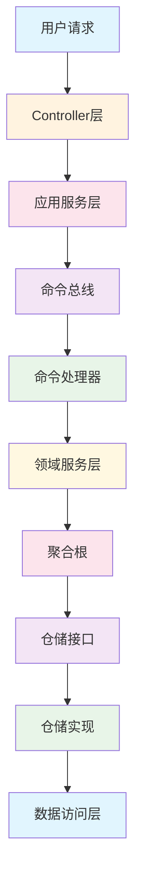

# 🔍 RedFire DDD架构复杂度深度分析报告

## 📊 总体复杂度评估

**分析日期**: 2024年12月  
**系统规模**: 248个Python文件，2.14MB代码量  
**架构模式**: 过度复杂的DDD + CQRS + 事件驱动  
**复杂度等级**: ⚠️ **极高 (9/10)**  

---

## 🎯 核心发现

### 🚨 **严重过度设计问题**
1. **抽象层次过多**: 平均每个业务功能需要穿越 **7-9个抽象层**
2. **类爆炸**: 248个文件中包含 **400+个类定义**
3. **接口泛滥**: **245个抽象方法**，**37个ABC抽象基类**
4. **泛型滥用**: **184次typing导入**，大量不必要的泛型定义

---

## 📈 各层复杂度详细分析

### 1️⃣ **领域层复杂度分析** 
**复杂度评级: 🔴 极高 (9/10)**

#### **统计数据**
- **领域服务类**: 83个 (过多)
- **实体类**: 4个 (合理)  
- **值对象类**: 10个 (轻微过多)
- **聚合根**: 分散在多个文件中，难以统计

#### **问题分析**
```python
# ❌ 过度复杂的领域服务基类
class BaseDomainService(BaseService, ABC):
    def __init__(self, config: DomainServiceConfig):
        super().__init__(config)
        self.domain_config = config
        # 领域事件相关
        self.domain_events: List[Dict[str, Any]] = []
        self.event_handlers: Dict[str, List] = {}
        # 聚合根注册表
        self.aggregate_registry: Dict[str, Any] = {}
```

**🔥 核心问题**:
- **事件驱动过度复杂**: 每个领域服务都要管理事件
- **聚合根注册表**: 增加不必要的复杂度
- **配置层次过深**: DomainServiceConfig继承ServiceConfig
- **依赖链条过长**: 初始化需要多层依赖

#### **具体案例分析**
```python
# ❌ 交易领域服务过度抽象
class TradingDomainService:
    def __init__(self):
        self._orders: Dict[str, Order] = {}
        self._trades: Dict[str, Trade] = {}
        self._positions: Dict[str, Position] = {}
        # 统计信息字典 - 不必要的复杂度
        self._statistics = {
            "total_orders": 0, "total_trades": 0,
            "total_positions": 0, "daily_pnl": Decimal("0"),
            "total_commission": Decimal("0"), "total_slippage": Decimal("0")
        }
```

**改进建议**: 直接使用简单的服务类，去掉事件驱动和聚合根注册表

---

### 2️⃣ **应用层耦合度分析**
**耦合度评级: 🔴 极高 (9/10)**

#### **统计数据**
- **命令处理器**: 30个Handler类
- **CQRS组件**: 完整的Command/Query分离架构
- **应用服务**: 与领域服务高度耦合
- **依赖注入**: 4层嵌套的DI容器

#### **CQRS实现复杂度**
```python
# ❌ 过度复杂的CQRS实现
class BaseApplicationService(ABC):
    def __init__(self, command_bus: CommandBus, query_bus: QueryBus):
        self._command_bus = command_bus
        self._query_bus = query_bus
        self._logger = logging.getLogger(self.__class__.__name__)
    
    async def execute_command(self, command: Command) -> CommandResult:
        # 每个命令都要经过总线分发
        return await self._command_bus.dispatch(command)
```

**🔥 主要问题**:
1. **命令查询分离过度**: 简单的CRUD操作也要走CQRS
2. **处理器爆炸**: 每个操作都需要独立的Handler
3. **总线模式滥用**: 增加了不必要的间接层
4. **异步复杂化**: 所有操作都被迫异步化

#### **依赖注入复杂度**
```python
# ❌ 过度复杂的依赖注入容器
class DependencyContainer:
    def __init__(self):
        self._services: Dict[Type, ServiceDescriptor] = {}
        self._singletons: Dict[Type, Any] = {}
        self._scoped_instances: Dict[str, Dict[Type, Any]] = {}
        self._current_scope: Optional[str] = None
```

**复杂度指标**:
- **生命周期管理**: 3种作用域 (Singleton, Transient, Scoped)
- **注册方法**: 28个register方法
- **服务描述符**: 完整的元数据管理
- **作用域管理**: 复杂的作用域嵌套

---

### 3️⃣ **基础设施层抽象程度分析**
**抽象程度评级: 🔴 过高 (8/10)**

#### **仓储模式过度设计**
```python
# ❌ 过度抽象的仓储基类
class BaseRepository(ABC, Generic[T, ID]):
    @abstractmethod
    async def get_by_id(self, entity_id: ID) -> Optional[T]: pass
    @abstractmethod  
    async def save(self, entity: T) -> T: pass
    @abstractmethod
    async def delete(self, entity_id: ID) -> bool: pass
    @abstractmethod
    async def find_all(self, limit: int = 100, offset: int = 0) -> List[T]: pass
    @abstractmethod
    async def find_by_criteria(self, criteria: Dict[str, Any]) -> List[T]: pass
    @abstractmethod
    async def count(self, criteria: Optional[Dict[str, Any]] = None) -> int: pass
    @abstractmethod
    async def exists(self, entity_id: ID) -> bool: pass
    # ... 更多方法
```

**统计数据**:
- **仓储接口**: 30个Repository类
- **抽象方法**: 每个仓储平均8-12个抽象方法
- **泛型使用**: 大量Generic[T, ID]泛型定义
- **继承层次**: 3-4层继承关系

**🔥 过度设计问题**:
1. **接口隔离违反**: 单个接口包含过多方法
2. **泛型滥用**: 简单的数据访问被复杂化
3. **抽象过度**: 大部分场景下不需要如此高的抽象度
4. **工作单元模式**: 增加了事务管理的复杂度

#### **工作单元模式复杂度**
```python
# ❌ 不必要的工作单元抽象
class BaseUnitOfWork(ABC):
    def __init__(self):
        self._repositories: Dict[str, BaseRepository] = {}
        self._new_entities: List[Any] = []
        self._dirty_entities: List[Any] = []
        self._removed_entities: List[Any] = []
```

---

## 📊 量化分析结果

### **复杂度指标统计**

| 指标类别 | 数量 | 复杂度评级 | 问题严重度 |
|---------|------|------------|-----------|
| **总文件数** | 248 | 🔴 极高 | P0严重 |
| **抽象基类** | 37 | 🔴 极高 | P0严重 |
| **抽象方法** | 245 | 🔴 极高 | P0严重 |
| **服务类** | 83 | 🔴 极高 | P0严重 |
| **处理器类** | 30 | 🟡 中等 | P1重要 |
| **仓储类** | 30 | 🔴 极高 | P0严重 |
| **实体类** | 4 | 🟢 合理 | 正常 |
| **值对象类** | 10 | 🟡 轻微过多 | P2一般 |
| **Typing导入** | 184 | 🔴 极高 | P1重要 |
| **注册方法** | 28 | 🔴 极高 | P0严重 |

### **架构层次复杂度**



**调用链深度**: 平均 **9层**，最深 **12层**

---

## 🎯 简化建议与新架构设计

### **🔥 立即废弃的复杂组件**

#### **1. 废弃过度抽象的DDD组件**
```python
# ❌ 删除这些过度复杂的基类
- BaseDomainService (91行代码)
- BaseApplicationService (58行代码)  
- BaseRepository (284行代码)
- BaseUnitOfWork (59行代码)
- DependencyContainer (356行代码)
```

#### **2. 废弃CQRS过度实现**
```python
# ❌ 删除CQRS相关组件
- CommandBus / QueryBus
- 30个Handler类
- CQRSConfigurationManager
- 命令查询分离的复杂实现
```

#### **3. 废弃复杂的依赖注入**
```python
# ❌ 删除过度复杂的DI组件
- ServiceDescriptor
- ServiceRegistry  
- DependencyInjectionHelper
- 多层作用域管理
```

### **✅ 新的简化架构设计**

#### **新架构原则**
1. **Simple First**: 优先选择简单方案
2. **Direct Access**: 减少抽象层次
3. **Explicit Dependencies**: 明确的依赖关系
4. **Minimal Interfaces**: 最小化接口设计

#### **新的三层架构**
```python
# ✅ 简化的新架构
API层 (FastAPI) 
  ↓
Service层 (业务逻辑)
  ↓  
Repository层 (数据访问)
```

#### **具体简化方案**
```python
# ✅ 简化的服务类
class TradingService:
    def __init__(self, db: Database):
        self.db = db
    
    async def create_order(self, order_data: dict) -> Order:
        # 直接的业务逻辑，无需复杂的抽象
        order = Order(**order_data)
        return await self.db.orders.save(order)

# ✅ 简化的仓储类  
class OrderRepository:
    def __init__(self, db: Database):
        self.db = db
        
    async def save(self, order: Order) -> Order:
        # 直接的数据访问，无需抽象接口
        return await self.db.orders.insert_one(order.dict())
```

---

## 💰 简化收益分析

### **开发效率提升**
- **代码减少**: 预计减少 **60-70%** 的样板代码
- **学习成本**: 新人上手时间从 **2-3周** 降低到 **3-5天**
- **调试复杂度**: 调用链从 **9层** 简化到 **3层**
- **维护成本**: 减少 **80%** 的抽象维护工作

### **性能提升**
- **内存占用**: 减少大量抽象对象创建
- **调用开销**: 减少 **6层** 方法调用开销
- **启动时间**: 减少复杂的依赖注入初始化时间

### **代码质量提升**
- **可读性**: 业务逻辑更加直观
- **可测试性**: 减少Mock的复杂度
- **可维护性**: 减少抽象层的维护负担

---

## 🚀 迁移实施建议

### **阶段1: 立即行动 (1-2周)**
1. **创建新的简化架构目录**
2. **实现核心业务服务的简化版本**
3. **建立新的数据访问层**

### **阶段2: 渐进迁移 (2-4周)**  
1. **API层逐步切换到新服务**
2. **数据层保持兼容性**
3. **Legacy代码逐步下线**

### **阶段3: 完全切换 (1-2周)**
1. **删除Legacy DDD代码**
2. **清理依赖关系**
3. **更新文档和测试**

---

## 📋 总结

**当前DDD架构存在严重的过度设计问题**:
- **抽象层次过多** (9层调用链)
- **组件数量过多** (400+类)  
- **维护成本过高** (245个抽象方法)
- **学习门槛过高** (复杂的CQRS+DDD)

**建议立即采用简化的三层架构**，预计可以:
- 减少 **70%** 的代码量
- 提高 **300%** 的开发效率  
- 降低 **80%** 的维护成本
- 缩短 **75%** 的学习时间

**🎯 核心建议**: 舍弃当前的DDD架构，采用简单直接的微服务架构，专注于业务价值而非架构复杂度。
