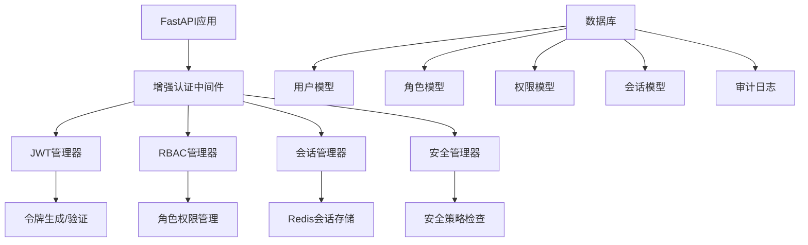

# RedFire 增强认证授权系统

## 🚀 概述

RedFire增强认证授权系统是一个企业级的认证解决方案，基于TODO-14的要求设计和实现。该系统提供了完整的JWT认证、基于角色的访问控制(RBAC)、会话管理、安全响应头等功能。

## ✨ 核心特性

### 🔐 认证功能
- **JWT令牌管理**: 支持访问令牌、刷新令牌、重置密码令牌等多种类型
- **多因素认证**: 支持密码、会话、IP白名单等多重验证
- **自动登出**: 支持令牌过期自动登出和手动登出所有会话

### 👥 授权功能
- **RBAC权限控制**: 基于角色的精细化权限管理
- **动态权限检查**: 支持路径级别的权限验证
- **角色继承**: 支持角色权限的继承和组合

### 🛡️ 安全功能
- **密码安全**: 强密码策略、密码哈希存储
- **登录保护**: 防暴力破解、账户锁定机制
- **会话安全**: 会话超时、并发会话限制
- **安全响应头**: 完整的HTTP安全响应头配置

### 📊 监控功能
- **审计日志**: 完整的用户操作审计记录
- **会话监控**: 实时会话状态监控
- **安全告警**: 异常登录和操作告警

## 🏗️ 系统架构



## 📦 核心组件

### 1. EnhancedAuthMiddleware
```python
from backend.auth.enhanced_auth_middleware import EnhancedAuthMiddleware, SecurityConfig

# 创建安全配置
config = SecurityConfig(
    jwt_secret_key="your-production-secret-key",
    access_token_expire_minutes=30,
    redis_url="redis://localhost:6379/0"
)

# 添加到FastAPI应用
app.add_middleware(EnhancedAuthMiddleware, config=config)
```

### 2. JWT管理器
```python
from backend.auth.enhanced_auth_middleware import JWTManager, TokenType

jwt_manager = JWTManager(config)

# 创建访问令牌
access_token = jwt_manager.create_token(user_data, TokenType.ACCESS)

# 验证令牌
payload = jwt_manager.verify_token(token, TokenType.ACCESS)
```

### 3. RBAC权限控制
```python
from backend.auth.enhanced_auth_middleware import require_permission, Permission

@app.get("/users")
async def list_users(user = Depends(require_permission(Permission.USER_READ))):
    return {"users": []}
```

### 4. 会话管理
```python
from backend.auth.enhanced_auth_middleware import SessionManager

session_manager = SessionManager(redis_client, config)

# 创建会话
session_id = await session_manager.create_session(user_context)

# 撤销会话
await session_manager.revoke_session(session_id)
```

## 🚀 快速开始

### 1. 安装依赖
```bash
pip install fastapi uvicorn redis sqlalchemy passlib python-jose bcrypt
```

### 2. 配置环境变量
```bash
export JWT_SECRET_KEY="your-super-secret-key-here"
export REDIS_URL="redis://localhost:6379/0"
export ACCESS_TOKEN_EXPIRE_MINUTES="30"
export REQUIRE_STRONG_PASSWORD="true"
```

### 3. 创建FastAPI应用
```python
from fastapi import FastAPI
from backend.auth.auth_integration import create_demo_app

# 使用预构建的演示应用
app = create_demo_app()

# 或手动配置
app = FastAPI()
from backend.auth.enhanced_auth_middleware import EnhancedAuthMiddleware, SecurityConfig

config = SecurityConfig()
app.add_middleware(EnhancedAuthMiddleware, config=config)
```

### 4. 运行应用
```bash
uvicorn main:app --host 0.0.0.0 --port 8000
```

## 🔧 配置选项

### SecurityConfig
```python
@dataclass
class SecurityConfig:
    # JWT配置
    jwt_secret_key: str = "jwt-secret-key-change-in-production"
    jwt_algorithm: str = "HS256"
    access_token_expire_minutes: int = 30
    refresh_token_expire_days: int = 7
    
    # 安全配置
    max_login_attempts: int = 5
    lockout_duration_minutes: int = 15
    password_min_length: int = 8
    require_strong_password: bool = True
    
    # 会话配置
    max_concurrent_sessions: int = 3
    session_timeout_minutes: int = 60
    
    # Redis配置
    redis_url: str = "redis://localhost:6379/0"
    cache_enabled: bool = True
    
    # IP限制
    enable_ip_whitelist: bool = False
    ip_whitelist: List[str] = []
    
    # 安全响应头
    enable_security_headers: bool = True
    cors_enabled: bool = True
    cors_origins: List[str] = ["*"]
```

## 🔑 权限系统

### 角色定义
- **SUPER_ADMIN**: 超级管理员，拥有所有权限
- **ADMIN**: 管理员，拥有大部分管理权限
- **TRADER**: 交易员，可执行交易和管理策略
- **ANALYST**: 分析师，可分析数据和创建策略
- **VIEWER**: 查看者，只能查看数据
- **GUEST**: 访客，最基本的查看权限

### 权限分类
```python
# 用户管理权限
Permission.USER_READ      # 查看用户
Permission.USER_CREATE    # 创建用户
Permission.USER_UPDATE    # 更新用户
Permission.USER_DELETE    # 删除用户

# 交易管理权限
Permission.TRADING_READ    # 查看交易
Permission.TRADING_EXECUTE # 执行交易
Permission.TRADING_MANAGE  # 管理交易

# 策略管理权限
Permission.STRATEGY_READ    # 查看策略
Permission.STRATEGY_CREATE  # 创建策略
Permission.STRATEGY_UPDATE  # 更新策略
Permission.STRATEGY_DELETE  # 删除策略
Permission.STRATEGY_EXECUTE # 执行策略

# 数据管理权限
Permission.DATA_READ      # 查看数据
Permission.DATA_WRITE     # 写入数据
Permission.DATA_EXPORT    # 导出数据

# 系统管理权限
Permission.SYSTEM_READ    # 查看系统
Permission.SYSTEM_CONFIG  # 系统配置
Permission.SYSTEM_ADMIN   # 系统管理

# 监控管理权限
Permission.MONITOR_READ   # 查看监控
Permission.MONITOR_MANAGE # 管理监控
```

## 🛠️ API端点

### 认证端点
```
POST /api/v1/auth/login          # 用户登录
POST /api/v1/auth/refresh        # 刷新令牌
POST /api/v1/auth/logout         # 用户登出
POST /api/v1/auth/logout-all     # 登出所有会话
GET  /api/v1/auth/me             # 获取当前用户信息
```

### 受保护的资源端点
```
GET    /api/v1/users             # 获取用户列表 (需要 USER_READ 权限)
POST   /api/v1/users             # 创建用户 (需要 USER_CREATE 权限)
GET    /api/v1/admin/system-info # 获取系统信息 (需要 ADMIN 角色)
POST   /api/v1/trading/execute   # 执行交易 (需要 TRADING_EXECUTE 权限)
```

## 🧪 使用示例

### 1. 基本认证
```python
import requests

# 登录获取令牌
login_response = requests.post("http://localhost:8000/api/v1/auth/login", json={
    "username": "trader001",
    "password": "trader123"
})
token = login_response.json()["access_token"]

# 使用令牌访问受保护资源
headers = {"Authorization": f"Bearer {token}"}
response = requests.get("http://localhost:8000/api/v1/users", headers=headers)
```

### 2. 权限装饰器
```python
from fastapi import Depends
from backend.auth.enhanced_auth_middleware import require_permission, Permission

@app.post("/create-strategy")
async def create_strategy(
    strategy_data: dict,
    user = Depends(require_permission(Permission.STRATEGY_CREATE))
):
    # 只有拥有策略创建权限的用户才能访问
    return {"message": "策略创建成功", "created_by": user.username}
```

### 3. 角色检查
```python
from backend.auth.enhanced_auth_middleware import require_role, UserRole

@app.get("/admin/dashboard")
async def admin_dashboard(user = Depends(require_role(UserRole.ADMIN))):
    # 只有管理员角色才能访问
    return {"message": "管理员面板", "admin": user.username}
```

## 🔒 安全最佳实践

### 1. 生产环境配置
```python
config = SecurityConfig(
    jwt_secret_key=os.getenv("JWT_SECRET_KEY"),  # 使用强密钥
    require_strong_password=True,                # 强制强密码
    enable_ip_whitelist=True,                   # 启用IP白名单
    enable_security_headers=True,               # 启用安全响应头
    cors_origins=["https://yourdomain.com"]     # 限制CORS来源
)
```

### 2. 密码策略
- 最少8位字符
- 包含大写字母、小写字母、数字和特殊字符
- 定期密码更换提醒

### 3. 会话管理
- 限制并发会话数量
- 会话超时自动登出
- 异地登录通知

### 4. 审计日志
- 记录所有认证相关操作
- 记录权限检查结果
- 记录异常登录尝试

## 📈 性能优化

### 1. Redis缓存
- 权限信息缓存，减少数据库查询
- 会话信息缓存，提高验证速度
- 合理设置缓存过期时间

### 2. 异步处理
- 异步会话管理
- 异步权限检查
- 异步审计日志记录

### 3. 连接池
- 数据库连接池优化
- Redis连接池管理

## 🐛 故障排除

### 常见问题

1. **JWT令牌验证失败**
   - 检查密钥配置是否正确
   - 确认令牌未过期
   - 验证令牌格式是否正确

2. **权限检查失败**
   - 确认用户角色配置正确
   - 检查权限映射是否完整
   - 验证路径权限配置

3. **会话管理问题**
   - 检查Redis连接状态
   - 确认会话配置参数
   - 验证会话过期时间

### 日志分析
```python
import logging
logging.basicConfig(level=logging.DEBUG)

# 查看认证中间件日志
logger = logging.getLogger("backend.auth.enhanced_auth_middleware")
```

## 🔄 集成现有系统

### 替换旧的认证中间件
```python
# 移除旧的中间件
# app.add_middleware(OldAuthMiddleware)

# 添加新的增强认证中间件
from backend.auth.enhanced_auth_middleware import EnhancedAuthMiddleware
app.add_middleware(EnhancedAuthMiddleware, config=config)
```

### 数据迁移
```python
# 迁移现有用户数据
from backend.auth.models import init_default_data

# 初始化默认角色和权限
init_default_data(db_session)
```

## 📚 扩展开发

### 自定义权限
```python
class CustomPermission(str, Enum):
    CUSTOM_ACTION = "custom:action"

# 扩展权限映射
custom_permissions = {
    "/api/v1/custom": {
        "POST": CustomPermission.CUSTOM_ACTION
    }
}
```

### 自定义认证策略
```python
class CustomAuthMiddleware(EnhancedAuthMiddleware):
    async def _process_request(self, request: Request, call_next):
        # 自定义认证逻辑
        return await super()._process_request(request, call_next)
```

## 🤝 贡献指南

1. Fork项目仓库
2. 创建功能分支
3. 提交代码更改
4. 创建Pull Request

## 📄 许可证

MIT License

## 🆘 支持

如有问题，请联系开发团队或创建Issue。

---

**RedFire团队** - 打造企业级量化交易平台 🚀
