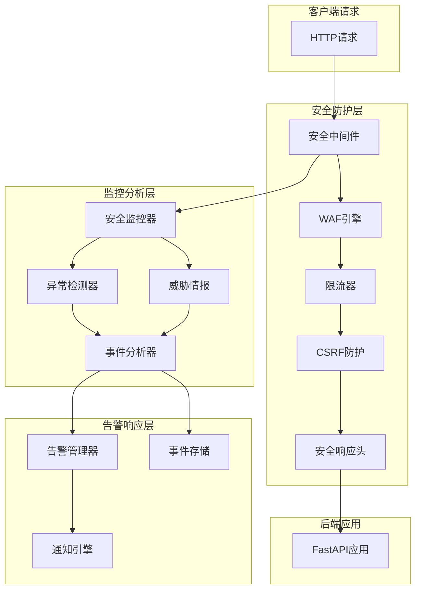

# 🛡️ RedFire 企业级安全防护系统

## 🚀 概述

RedFire安全防护系统是一个全面的企业级Web应用安全解决方案，基于TODO-15的要求设计和实现。该系统提供了多层级的安全防护，包括Web应用防火墙、智能限流、实时监控、威胁检测和告警等功能。

## ✨ 核心特性

### 🛡️ Web应用防火墙 (WAF)
- **SQL注入防护**: 多层模式检测，支持高、中、低敏感度设置
- **XSS攻击防护**: 全面的跨站脚本攻击检测和阻断
- **CSRF防护**: 令牌验证机制，防止跨站请求伪造
- **路径遍历防护**: 防止目录遍历和文件访问攻击
- **命令注入防护**: 检测和阻断系统命令注入尝试
- **文件上传安全**: 文件类型检查、大小限制、恶意文件扫描

### 🚦 智能限流系统
- **多种算法支持**: 令牌桶、滑动窗口、固定窗口、自适应算法
- **多维度限流**: 全局、IP、用户、端点级别的精细化限流
- **分布式限流**: Redis支持的分布式限流机制
- **DDoS防护**: 智能DDoS检测和自动IP黑名单
- **动态调整**: 基于系统负载的自适应限流策略

### 📊 安全监控系统
- **实时事件监控**: 全面的安全事件收集和分析
- **异常检测**: 基于机器学习的异常行为检测
- **威胁情报集成**: 恶意IP、域名、威胁签名数据库
- **安全指标统计**: 实时安全指标计算和趋势分析
- **审计日志**: 完整的安全操作审计记录

### 🚨 智能告警系统
- **多渠道通知**: 邮件、Webhook、短信、日志等多种告警方式
- **智能聚合**: 相关事件的智能聚合和去重
- **严重程度分级**: 基于威胁级别的自动告警策略
- **告警管理**: 告警确认、解决、状态跟踪

### 🔐 安全配置管理
- **多环境配置**: 开发、测试、生产环境的差异化配置
- **安全策略**: 灵活的安全策略配置和验证
- **密钥管理**: 安全的密钥生成、轮换和管理
- **配置热更新**: 支持配置的动态更新和验证

## 🏗️ 系统架构



## 📦 核心组件

### 1. SecurityConfigManager
```python
from backend.security import SecurityConfigManager, security_config

# 使用全局配置
config = security_config

# 或创建自定义配置
custom_config = SecurityConfigManager(environment="production")
```

### 2. SecurityMiddleware
```python
from backend.security import SecurityMiddleware, create_security_middleware

# 创建安全中间件
middleware = create_security_middleware(config)

# 添加到FastAPI应用
app.add_middleware(SecurityMiddleware, config=config)
```

### 3. SmartRateLimiter
```python
from backend.security import SmartRateLimiter

# 创建智能限流器
rate_limiter = SmartRateLimiter(config)

# 检查限流
result = await rate_limiter.check_rate_limit(request, user_id)
```

### 4. SecurityMonitor
```python
from backend.security import SecurityMonitor, SecurityEvent, EventType

# 创建安全监控器
monitor = SecurityMonitor(config)

# 记录安全事件
event = SecurityEvent(...)
await monitor.record_event(event)
```

## 🚀 快速开始

### 1. 一键集成
```python
from fastapi import FastAPI
from backend.security import setup_security

# 创建FastAPI应用
app = FastAPI()

# 一键集成安全防护
security = setup_security(app)

# 现在你的应用已经具备完整的安全防护功能
```

### 2. 自定义配置
```python
from backend.security import SecurityConfigManager, setup_security

# 创建自定义配置
config = SecurityConfigManager(environment="production")

# 修改配置
config.waf.sql_injection_protection = True
config.rate_limit.global_requests_per_minute = 1000

# 使用自定义配置
security = setup_security(app, config)
```

### 3. 手动记录安全事件
```python
from backend.security import EventType, SecurityLevel

@app.post("/sensitive-operation")
async def sensitive_operation(request: Request):
    # 执行敏感操作
    try:
        result = perform_operation()
        
        # 记录成功事件
        await security.record_security_event(
            event_type=EventType.PRIVILEGE_ESCALATION,
            request=request,
            severity=SecurityLevel.MEDIUM,
            description="敏感操作执行成功"
        )
        
        return result
        
    except Exception as e:
        # 记录失败事件
        await security.record_security_event(
            event_type=EventType.SYSTEM_COMPROMISE,
            request=request,
            severity=SecurityLevel.HIGH,
            description=f"敏感操作失败: {str(e)}",
            blocked=True
        )
        raise
```

### 4. 使用装饰器
```python
from backend.security import log_security_event, EventType, SecurityLevel

@app.get("/admin/users")
@log_security_event(EventType.AUTHORIZATION_FAILURE, SecurityLevel.MEDIUM, "访问用户管理")
async def admin_users(request: Request):
    return {"users": []}
```

## 🔧 配置说明

### 环境变量配置
```bash
# 基础配置
ENVIRONMENT=production
JWT_SECRET_KEY=your-strong-secret-key
ENCRYPTION_KEY=your-encryption-key

# Redis配置
REDIS_HOST=localhost
REDIS_PORT=6379

# 邮件告警配置
SMTP_SERVER=smtp.gmail.com
SMTP_PORT=587
SMTP_USERNAME=your-email@gmail.com
SMTP_PASSWORD=your-app-password
ALERT_EMAIL=admin@yourcompany.com

# Webhook告警配置
ALERT_WEBHOOK_URL=https://your-webhook-url.com/alerts
```

### 生产环境最佳实践
```python
# 生产环境安全配置示例
config = SecurityConfigManager(environment="production")

# WAF配置
config.waf.protection_mode = ProtectionMode.BLOCK
config.waf.sql_injection_sensitivity = SecurityLevel.HIGH
config.waf.xss_sensitivity = SecurityLevel.HIGH

# 限流配置
config.rate_limit.global_requests_per_minute = 1000
config.rate_limit.ip_requests_per_minute = 100
config.rate_limit.distributed_mode = True

# 监控配置
config.monitoring.real_time_monitoring = True
config.monitoring.alert_enabled = True
config.monitoring.audit_enabled = True

# 安全响应头
config.headers.strict_transport_security = True
config.headers.content_security_policy = True
```

## 📊 API接口

### 安全状态接口
```http
GET /api/security/status
```
获取安全系统整体状态

### CSRF令牌接口
```http
GET /api/security/csrf-token
Authorization: Bearer <your-token>
```
获取CSRF防护令牌

### 限流状态接口
```http
GET /api/security/rate-limits
```
获取当前用户的限流状态

### 安全告警接口
```http
GET /api/security/alerts
POST /api/security/alerts/{alert_id}/acknowledge
POST /api/security/alerts/{alert_id}/resolve
```
管理安全告警

### 安全事件报告接口
```http
POST /api/security/report-incident
Content-Type: application/json

{
    "description": "发现可疑活动",
    "severity": "MEDIUM",
    "details": {...}
}
```

## 🔍 监控指标

### 核心安全指标
- **总事件数**: 当日安全事件总数
- **威胁分数**: 基于事件严重程度的威胁评分
- **攻击类型分布**: 各类攻击的分布统计
- **阻断率**: 成功阻断的攻击比例
- **响应时间**: 安全检查的平均响应时间

### 限流指标
- **请求通过率**: 成功通过限流检查的请求比例
- **限流触发次数**: 各级别限流的触发统计
- **热点IP**: 请求频率最高的IP地址
- **热点端点**: 访问频率最高的API端点

### 异常检测指标
- **异常登录**: 异常时间、地点的登录尝试
- **行为异常**: 异常的用户行为模式
- **频率异常**: 异常的请求频率模式
- **地理异常**: 异常的地理位置访问

## 🚨 告警配置

### 邮件告警
```python
# 配置SMTP设置
import os
os.environ["SMTP_SERVER"] = "smtp.gmail.com"
os.environ["SMTP_PORT"] = "587"
os.environ["SMTP_USERNAME"] = "alerts@yourcompany.com"
os.environ["SMTP_PASSWORD"] = "your-app-password"
os.environ["ALERT_EMAIL"] = "security-team@yourcompany.com"
```

### Webhook告警
```python
# 配置Webhook URL
os.environ["ALERT_WEBHOOK_URL"] = "https://hooks.slack.com/services/..."

# Webhook数据格式
{
    "alert_id": "alert_1234567890",
    "title": "SQL注入攻击检测",
    "severity": "HIGH",
    "created_at": "2024-01-15T10:30:00Z",
    "events": [...]
}
```

### 告警规则
- **严重程度阈值**: 只有达到配置阈值的告警才会发送
- **事件聚合**: 相关事件自动聚合为单个告警
- **频率控制**: 防止告警轰炸的频率控制机制
- **告警升级**: 未处理告警的自动升级机制

## 🧪 测试和验证

### 安全测试
```python
# 测试SQL注入防护
import requests

# 这个请求应该被阻断
response = requests.get("http://localhost:8000/api/users?id=1' OR '1'='1")
assert response.status_code == 403

# 测试XSS防护
response = requests.post(
    "http://localhost:8000/api/comments",
    json={"content": "<script>alert('xss')</script>"}
)
assert response.status_code == 403
```

### 限流测试
```python
import asyncio
import aiohttp

async def test_rate_limit():
    async with aiohttp.ClientSession() as session:
        tasks = []
        for i in range(150):  # 超过限制的请求数
            task = session.get("http://localhost:8000/api/test")
            tasks.append(task)
        
        responses = await asyncio.gather(*tasks, return_exceptions=True)
        
        # 检查是否有429状态码
        rate_limited = [r for r in responses if hasattr(r, 'status') and r.status == 429]
        assert len(rate_limited) > 0
```

### 监控测试
```python
from backend.security import SecurityMonitor, SecurityEvent, EventType

# 测试事件记录
monitor = SecurityMonitor(config)
event = SecurityEvent(
    event_type=EventType.SQL_INJECTION,
    # ... 其他字段
)

await monitor.record_event(event)

# 检查仪表板数据
dashboard = await monitor.get_security_dashboard()
assert "metrics" in dashboard
```

## 🔧 故障排除

### 常见问题

1. **Redis连接失败**
   ```
   警告: Redis连接失败，使用内存存储
   ```
   - 检查Redis服务是否运行
   - 确认Redis连接配置正确
   - 验证网络连接

2. **邮件告警失败**
   ```
   错误: 发送邮件告警失败
   ```
   - 检查SMTP配置是否正确
   - 确认邮箱密码或应用密码
   - 验证SMTP服务器设置

3. **限流误判**
   ```
   警告: 正常请求被限流阻断
   ```
   - 检查限流阈值设置
   - 确认IP获取逻辑正确
   - 调整限流算法参数

4. **安全检查性能问题**
   ```
   警告: 安全检查响应时间过长
   ```
   - 优化正则表达式模式
   - 启用Redis缓存
   - 调整检查深度

### 日志分析
```python
import logging

# 设置详细日志
logging.basicConfig(level=logging.DEBUG)

# 查看安全系统日志
logger = logging.getLogger("backend.security")
logger.setLevel(logging.DEBUG)

# 关键日志位置
# - 安全事件: backend.security.security_monitor
# - WAF检测: backend.security.security_middleware  
# - 限流决策: backend.security.rate_limiter
# - 告警发送: backend.security.security_monitor
```

### 性能优化

1. **启用Redis缓存**
   ```python
   # 确保Redis配置正确
   config.rate_limit.distributed_mode = True
   ```

2. **调整检查深度**
   ```python
   # 减少正则检查数量
   config.waf.sql_injection_sensitivity = SecurityLevel.MEDIUM
   ```

3. **优化告警频率**
   ```python
   # 提高告警阈值
   config.monitoring.alert_severity_threshold = SecurityLevel.HIGH
   ```

## 📈 性能指标

### 基准性能
- **安全检查延迟**: < 10ms (平均)
- **限流检查延迟**: < 5ms (平均)
- **内存使用**: < 100MB (基础)
- **CPU使用**: < 5% (正常负载)

### 扩展性
- **并发处理**: 1000+ 并发请求
- **事件处理**: 10000+ 事件/分钟
- **告警响应**: < 30秒
- **存储容量**: 支持TB级事件存储

## 🛠️ 扩展开发

### 自定义安全规则
```python
class CustomWAFRule:
    def __init__(self):
        self.pattern = re.compile(r"custom_threat_pattern")
    
    def check(self, request_data: str) -> bool:
        return bool(self.pattern.search(request_data))

# 注册自定义规则
waf_engine.add_custom_rule(CustomWAFRule())
```

### 自定义告警渠道
```python
class CustomAlertHandler:
    async def send_alert(self, alert: SecurityAlert):
        # 实现自定义告警逻辑
        pass

# 注册自定义告警处理器
alert_manager.register_handler(AlertChannel.CUSTOM, CustomAlertHandler())
```

### 威胁情报集成
```python
class CustomThreatIntelligence:
    async def update_threat_data(self):
        # 从外部API获取威胁数据
        pass
    
    def is_malicious(self, indicator: str) -> bool:
        # 检查威胁指标
        pass

# 集成自定义威胁情报
threat_intel.add_source(CustomThreatIntelligence())
```

## 📚 相关文档

- [安全配置参考](./security_config.py)
- [中间件开发指南](./security_middleware.py)
- [限流算法详解](./rate_limiter.py)
- [监控系统架构](./security_monitor.py)
- [集成使用示例](./security_integration.py)

## 🆘 技术支持

### 获取帮助
1. **查看日志**: 检查应用日志中的安全相关信息
2. **运行诊断**: 使用内置的状态检查接口
3. **配置验证**: 检查安全配置是否正确
4. **性能分析**: 监控安全系统的性能指标

### 联系方式
- 项目文档: `backend/security/README.md`
- 使用示例: `backend/security/security_integration.py`
- 配置参考: `backend/security/security_config.py`

---

**RedFire 企业级安全防护系统** - 为您的应用提供全方位的安全保护 🛡️
