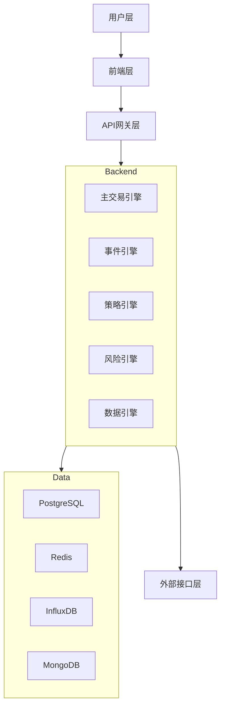

# 🏗️ RedFire系统整体架构

## 📋 概述

RedFire是一个基于微服务架构的量化交易系统，采用DDD（领域驱动设计）思想，支持多种交易接口，具备完整的风险管理体系。

## 🏛️ 架构层次

### 1. 用户层 (User Layer)
- **Web用户**: 通过浏览器访问交易界面
- **移动用户**: 移动端应用用户
- **专业交易员**: 专业交易终端用户

### 2. 前端层 (Frontend Layer)
- **Web应用**: React + TypeScript + Ant Design
- **移动应用**: React Native
- **管理后台**: 系统管理和监控界面
- **专业交易界面**: 高级交易功能界面

### 3. API网关层 (API Gateway Layer)
- **FastAPI网关**: 主要API入口
- **WebSocket服务**: 实时数据推送
- **认证授权**: JWT + OAuth2.0
- **负载均衡**: 请求分发和限流

### 4. 后端层 (Backend Layer)
- **主交易引擎**: 核心交易逻辑控制器
- **事件引擎**: 事件驱动架构核心
- **策略引擎**: 量化策略执行
- **风险引擎**: 实时风险监控
- **数据引擎**: 市场数据管理

### 5. 数据层 (Data Layer)
- **PostgreSQL**: 主数据库，存储交易数据
- **Redis**: 缓存层，提升性能
- **InfluxDB**: 时序数据库，存储市场数据
- **MongoDB**: 文档数据库，存储配置和日志

### 6. 外部接口层 (External Interface Layer)
- **CTP接口**: 期货交易接口
- **IB接口**: 国际经纪接口
- **OKEX接口**: 加密货币接口
- **市场数据源**: 实时行情数据

## 🔄 数据流向

```
用户操作 → 前端界面 → API网关 → 后端服务 → 数据存储
    ↓           ↓         ↓         ↓         ↓
市场数据 → 数据引擎 → 事件引擎 → 策略引擎 → 交易执行
    ↓           ↓         ↓         ↓         ↓
外部接口 → 网关接口 → 交易引擎 → 风险控制 → 结果反馈
```

## 🎯 核心特性

### 高可用性
- 微服务架构，服务独立部署
- 负载均衡和故障转移
- 数据库主从复制

### 高性能
- 异步事件处理
- Redis缓存优化
- 数据库连接池

### 可扩展性
- 插件化架构
- 水平扩展支持
- 模块化设计

### 安全性
- 多层安全防护
- 数据加密传输
- 权限控制体系

## 🔧 技术选型

### 前端技术栈
- **框架**: React 18 + TypeScript
- **UI库**: Ant Design
- **状态管理**: Redux Toolkit
- **构建工具**: Vite + Turborepo

### 后端技术栈
- **语言**: Python 3.9+
- **框架**: FastAPI
- **异步**: asyncio + aiohttp
- **消息队列**: Redis + Celery

### 数据库技术栈
- **关系型**: PostgreSQL 14+
- **缓存**: Redis 6+
- **时序**: InfluxDB 2.x
- **文档**: MongoDB 5+

### 运维技术栈
- **容器化**: Docker + Kubernetes
- **监控**: Prometheus + Grafana
- **日志**: ELK Stack
- **CI/CD**: GitHub Actions

## 📊 系统架构图



## 🚀 部署架构

### 开发环境
- 单机部署，所有服务运行在同一台机器
- Docker Compose管理服务
- 本地数据库和缓存

### 生产环境
- Kubernetes集群部署
- 服务高可用和负载均衡
- 数据库集群和备份策略

### 监控体系
- 应用性能监控 (APM)
- 基础设施监控
- 业务指标监控
- 告警和通知机制

## 📈 性能指标

### 响应时间
- API接口: < 100ms
- 数据库查询: < 50ms
- 实时数据推送: < 10ms

### 吞吐量
- 并发用户: 1000+
- 订单处理: 10000+ TPS
- 数据查询: 50000+ QPS

### 可用性
- 系统可用性: 99.9%
- 数据一致性: 99.99%
- 故障恢复时间: < 5分钟

## 🔮 未来规划

### 短期目标 (3个月)
- 完善监控体系
- 优化数据库性能
- 增强安全防护

### 中期目标 (6个月)
- 支持更多交易接口
- 引入机器学习策略
- 优化用户体验

### 长期目标 (1年)
- 云原生架构升级
- 国际化支持
- 生态合作伙伴

---

*RedFire系统整体架构 - 构建稳定、高效、可扩展的量化交易平台* 🔥
