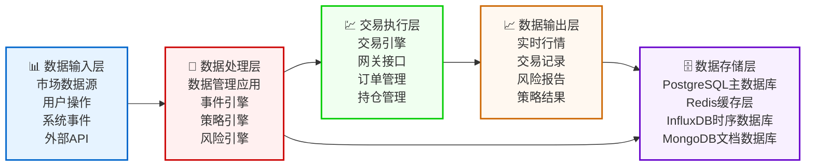
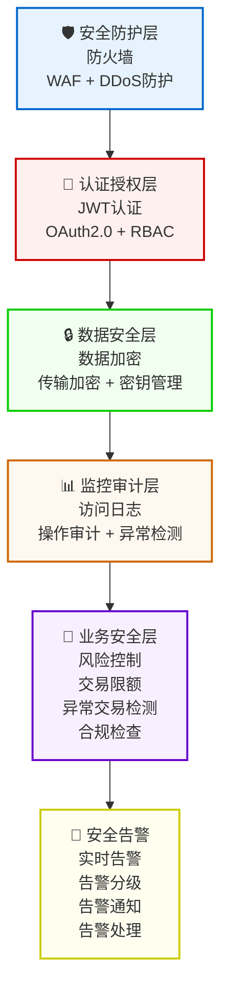
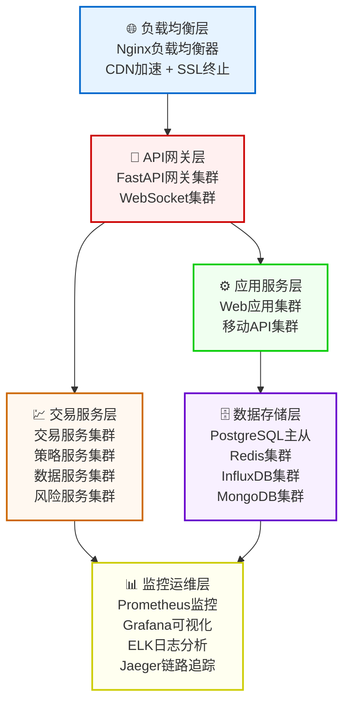
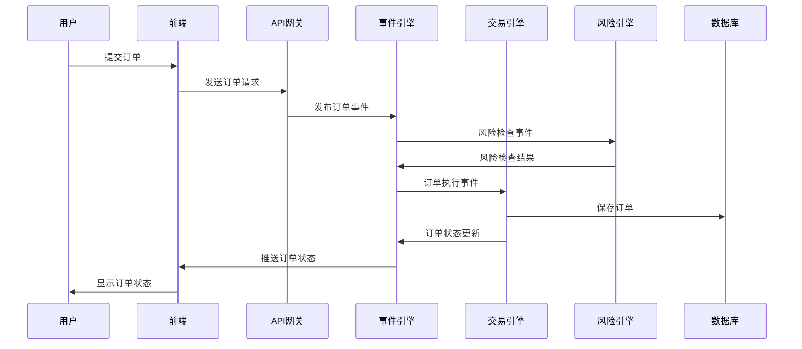
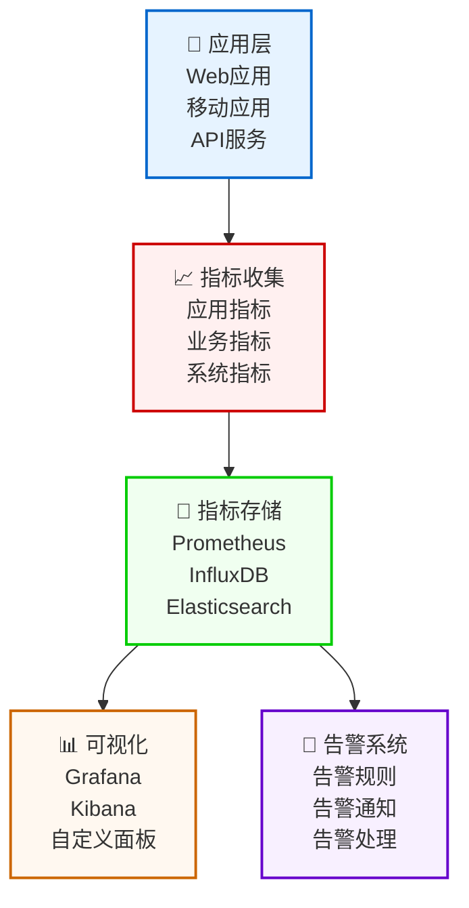
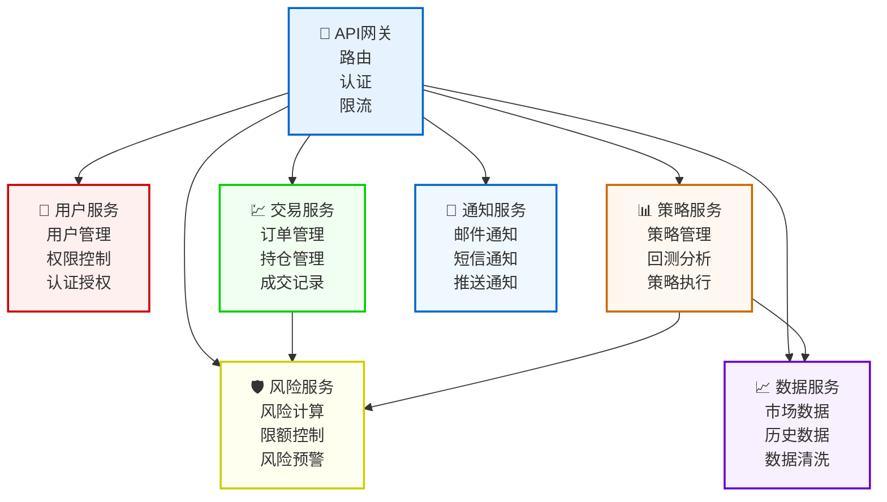

# 📊 RedFire架构图表

## 📋 概述

本文档包含RedFire项目的各种架构图表，使用Mermaid语法绘制，支持在GitHub、GitLab等平台上直接渲染。

## 🏗️ 系统整体架构图

```mermaid
graph TB
    User[🌐 用户层<br/>Web用户 | 移动用户 | 专业交易员]
    Frontend[🎨 前端层<br/>React + TypeScript<br/>Ant Design + 组件库<br/>移动应用 + 管理后台<br/>专业交易界面]
    Gateway[🔌 API网关层<br/>FastAPI网关<br/>WebSocket + 认证授权]
    Backend[⚙️ 后端层<br/>主交易引擎 + 事件引擎<br/>CTP/IB/OKEX引擎<br/>风险管理 + 数据管理<br/>策略管理 + 微服务架构<br/>DDD架构 + 插件系统<br/>引擎管理器 + 网关接口<br/>模拟网关 + 测试环境<br/>传统应用 + Vue.js后端]
    Data[🗄️ 数据层<br/>PostgreSQL主数据库<br/>Redis缓存层<br/>InfluxDB时序数据<br/>MongoDB文档数据]
    External[🌍 外部接口<br/>CTP期货接口<br/>IB交易接口<br/>OKEX接口<br/>市场数据源]
    
    User --> Frontend
    Frontend --> Gateway
    Gateway --> Backend
    Backend --> Data
    Backend --> External
    Data --> External
    
    classDef userLayer fill:#e6f3ff,stroke:#0066cc,stroke-width:2px
    classDef frontendLayer fill:#fff0f0,stroke:#cc0000,stroke-width:2px
    classDef gatewayLayer fill:#f0fff0,stroke:#00cc00,stroke-width:2px
    classDef backendLayer fill:#fff8f0,stroke:#cc6600,stroke-width:2px
    classDef dataLayer fill:#f8f0ff,stroke:#6600cc,stroke-width:2px
    classDef externalLayer fill:#fffff0,stroke:#cccc00,stroke-width:2px
    
    class User userLayer
    class Frontend frontendLayer
    class Gateway gatewayLayer
    class Backend backendLayer
    class Data dataLayer
    class External externalLayer
```

## 🔄 数据流架构图



## 🏗️ 后端架构详细图

```mermaid
graph TB
    MainEngine[🚀 主交易引擎<br/>主控制器<br/>组件管理器]
    EventSystem[⚡ 事件系统<br/>事件分发器<br/>事件队列]
    Management[🔧 管理组件<br/>引擎管理器<br/>插件管理器]
    TradingEngine[💹 交易引擎实现<br/>CTP引擎 (期货交易)<br/>IB引擎 (国际经纪)<br/>OKEX引擎 (加密货币)<br/>模拟网关 (测试环境)]
    AppComponent[📊 应用组件<br/>风险管理应用<br/>数据管理应用<br/>策略管理应用<br/>实时监控、预警]
    Gateway[🌐 网关接口<br/>基础网关抽象<br/>具体网关实现<br/>连接管理<br/>CTP/IB/OKEX接口]
    DataStorage[🗄️ 数据存储<br/>PostgreSQL主数据库<br/>Redis缓存<br/>InfluxDB时序数据<br/>MongoDB文档数据]
    
    MainEngine --> EventSystem
    MainEngine --> Management
    Management --> TradingEngine
    EventSystem --> AppComponent
    TradingEngine --> Gateway
    AppComponent --> DataStorage
    
    classDef mainEngine fill:#e6f3ff,stroke:#0066cc,stroke-width:2px
    classDef eventSystem fill:#fff0f0,stroke:#cc0000,stroke-width:2px
    classDef management fill:#f0fff0,stroke:#00cc00,stroke-width:2px
    classDef tradingEngine fill:#fff8f0,stroke:#cc6600,stroke-width:2px
    classDef appComponent fill:#f8f0ff,stroke:#6600cc,stroke-width:2px
    classDef gateway fill:#fffff0,stroke:#cccc00,stroke-width:2px
    classDef dataStorage fill:#f0f0ff,stroke:#0066cc,stroke-width:2px
    
    class MainEngine mainEngine
    class EventSystem eventSystem
    class Management management
    class TradingEngine tradingEngine
    class AppComponent appComponent
    class Gateway gateway
    class DataStorage dataStorage
```

## 🎨 前端架构详细图

```mermaid
graph TB
    AppLayer[📱 应用层<br/>Web应用 (React + TypeScript)<br/>移动应用 (React Native)<br/>管理后台 (Ant Design)<br/>专业交易界面]
    SharedLayer[📦 共享包层<br/>UI组件库<br/>业务组件库<br/>类型定义<br/>API客户端]
    BuildTools[🏗️ 构建工具<br/>Turborepo (Monorepo管理)<br/>Vite (快速构建)<br/>TypeScript (类型安全)<br/>ESLint + Prettier]
    Testing[🧪 测试体系<br/>Jest (单元测试)<br/>React Testing Library<br/>Cypress (E2E测试)<br/>Storybook (组件文档)]
    ThemeSystem[🎨 主题系统<br/>主题配置<br/>颜色系统<br/>组件样式<br/>响应式设计]
    Utils[🔧 工具库<br/>日期处理<br/>数据格式化<br/>验证工具<br/>HTTP客户端]
    
    AppLayer --> SharedLayer
    SharedLayer --> BuildTools
    AppLayer --> Testing
    SharedLayer --> ThemeSystem
    BuildTools --> Utils
    
    classDef appLayer fill:#e6f3ff,stroke:#0066cc,stroke-width:2px
    classDef sharedLayer fill:#fff0f0,stroke:#cc0000,stroke-width:2px
    classDef buildTools fill:#f0fff0,stroke:#00cc00,stroke-width:2px
    classDef testing fill:#fff8f0,stroke:#cc6600,stroke-width:2px
    classDef themeSystem fill:#f8f0ff,stroke:#6600cc,stroke-width:2px
    classDef utils fill:#fffff0,stroke:#cccc00,stroke-width:2px
    
    class AppLayer appLayer
    class SharedLayer sharedLayer
    class BuildTools buildTools
    class Testing testing
    class ThemeSystem themeSystem
    class Utils utils
```

## 🔐 安全架构图



## 🚀 部署架构图



## 🔄 事件驱动架构图



## 📊 性能监控架构图



## 🔧 微服务架构图



## 📋 图表使用说明

### 🎯 图表特点
1. **Mermaid语法**: 所有图表都使用Mermaid语法，支持GitHub、GitLab等平台
2. **层次清晰**: 从系统整体到组件细节，层次分明
3. **关系明确**: 清晰展示各组件间的依赖关系
4. **颜色丰富**: 使用不同颜色区分不同模块

### 🔧 使用方法
1. **直接渲染**: 在支持Mermaid的平台上直接显示
2. **导出图片**: 使用Mermaid Live Editor导出为PNG/SVG
3. **嵌入文档**: 将图表代码嵌入到其他文档中

### 🎨 自定义选项
- 修改颜色: 更改classDef中的fill和stroke属性
- 调整布局: 修改graph的方向（TB/LR/BT/RL）
- 添加样式: 在classDef中添加更多CSS样式

---

*RedFire架构图表 - 可视化系统架构，理解系统设计* 🔥
